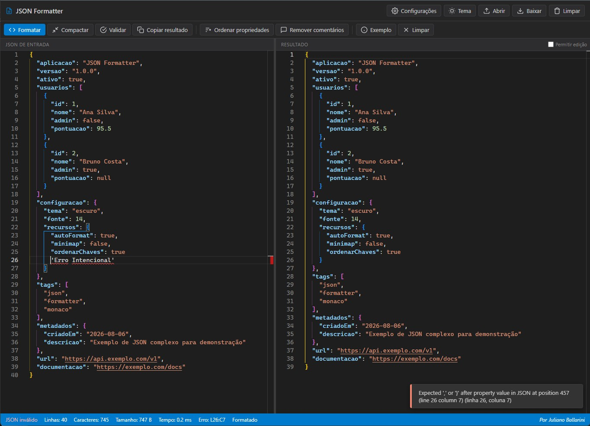
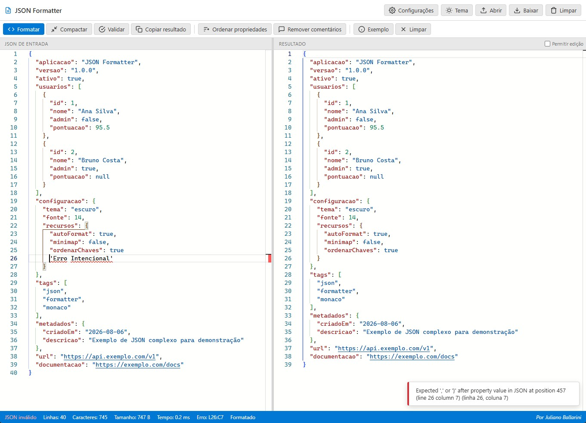

# SQL Formatter

[License: MIT](LICENSE)
[Version](CHANGELOG.md)
[Monaco Editor](https://github.com/microsoft/monaco-editor)
[sql-formatter](https://github.com/sql-formatter-org/sql-formatter)
[Offline](#uso-offline)

Ferramenta web **gratuita**, **local** e **offline** para colar, editar, validar, formatar e compactar consultas SQL — com interface inspirada no Visual Studio Code, editor Monaco e suporte a múltiplos dialetos.

Ideal para **desenvolvedores**, **DBAs** e **analistas de dados** que trabalham com PostgreSQL, MySQL, SQL Server, SQLite e outros bancos relacionais.

🔗 **Repositório:** [github.com/jsballarini/SQL-Formatter](https://github.com/jsballarini/SQL-Formatter)





---

## Índice

- [Por que usar?](#por-que-usar)
- [Funcionalidades](#funcionalidades)
- [Início rápido](#início-rápido)
- [Uso offline](#uso-offline)
- [Atalhos de teclado](#atalhos-de-teclado)
- [Configurações](#configurações)
- [Privacidade e segurança](#privacidade-e-segurança)
- [Estrutura do projeto](#estrutura-do-projeto)
- [Limites e comportamento](#limites-e-comportamento)
- [Contribuindo](#contribuindo)
- [Licença](#licença)

---

## Por que usar?

Consultas SQL mal formatadas dificultam code review, depuração e manutenção. O **SQL Formatter** oferece:

| Característica | Benefício |
| --- | --- |
| **100% local** | Suas queries não saem do navegador |
| **Sem instalação** | Abra o `index.html` e use |
| **Offline** | Monaco e sql-formatter incluídos localmente |
| **Múltiplos dialetos** | PostgreSQL, MySQL, SQL Server, SQLite e mais |
| **Editor profissional** | Monaco Editor — o mesmo motor do VS Code |
| **Gratuito e open source** | MIT License |

---

## Funcionalidades

### Operações SQL

| Ação | Descrição |
| --- | --- |
| **Formatar** | Pretty-print com indentação configurável |
| **Compactar** | Converte para uma única linha |
| **Validar** | Verifica sintaxe SQL (via parser do sql-formatter) |
| **Keywords maiúsculas** | Formata com keywords em UPPERCASE |
| **Remover comentários** | Remove `--` e `/* */` respeitando strings |
| **Copiar resultado** | Copia para a área de transferência |
| **Exemplo** | Carrega query de demonstração com CTE e JOINs |
| **Limpar** | Limpa ambos os editores (com confirmação) |

### Arquivos

- Upload por clique ou drag-and-drop (`.sql`)
- Download do resultado como `formatted-sql.sql`

### Automação

- Formatação automática com debounce (500 ms)
- Limite configurável de tamanho para auto-formatação

---

## Início rápido

1. Clone ou baixe o repositório
2. Abra `index.html` no navegador (ou sirva com servidor local)
3. Cole sua query SQL no painel esquerdo
4. Selecione o **dialeto** nas configurações se necessário
5. Clique em **Formatar** ou pressione `Ctrl+Enter`

```bash
# Servidor local recomendado
python -m http.server 8080
# ou: npx serve .
```

---

## Uso offline

```
SQL Formatter/
├── index.html
└── min/
    ├── vs/                    # Monaco Editor 0.45.0
    └── sql-formatter.min.js   # sql-formatter 15.8.2
```

Não é necessária conexão com a internet após o download do repositório.

---

## Atalhos de teclado

| Atalho | Ação |
| --- | --- |
| `Ctrl+Enter` | Formatar |
| `Ctrl+Shift+M` | Compactar |
| `Ctrl+Shift+V` | Validar |
| `Ctrl+Shift+C` | Copiar resultado |
| `Ctrl+L` | Limpar |
| `Ctrl+O` | Abrir arquivo |
| `Ctrl+S` | Baixar resultado |
| `F1` | Exibir atalhos |

Suporte equivalente com `Command` no macOS.

---

## Configurações

Persistidas em `localStorage` (`sql-formatter-settings`):

- Tema claro/escuro
- Indentação (2, 4 ou tab)
- Tamanho da fonte (12–20)
- Minimap e word wrap
- **Dialeto SQL**
- **Estilo de keywords** (preservar, maiúsculas, minúsculas)
- Formatação automática e limite de tamanho

---

## Privacidade e segurança

Todo o processamento ocorre **100% no navegador**. Nenhuma consulta SQL é enviada a servidores externos. Consulte [SECURITY.md](SECURITY.md).

---

## Estrutura do projeto

| Arquivo / pasta | Descrição |
| --- | --- |
| `index.html` | Aplicação completa (HTML + CSS + JS) |
| `min/vs/` | Monaco Editor local |
| `min/sql-formatter.min.js` | Biblioteca de formatação SQL |
| `docs/images/` | Screenshots |
| `README.md`, `CHANGELOG.md` | Documentação |

---

## Limites e comportamento

- Validação é **sintática**, não semântica contra schema real
- Stored procedures e constructs exóticos podem falhar (limitação do sql-formatter)
- Upload máximo: **5 MB**
- Auto-formatação padrão: até **512 KB**
- Web Worker acima de **256 KB**

---

## Contribuindo

Consulte [CONTRIBUTING.md](CONTRIBUTING.md). Issues e pull requests são bem-vindos.

---

## Licença

[MIT](LICENSE) — Copyright (c) 2026 Juliano Ballarini
